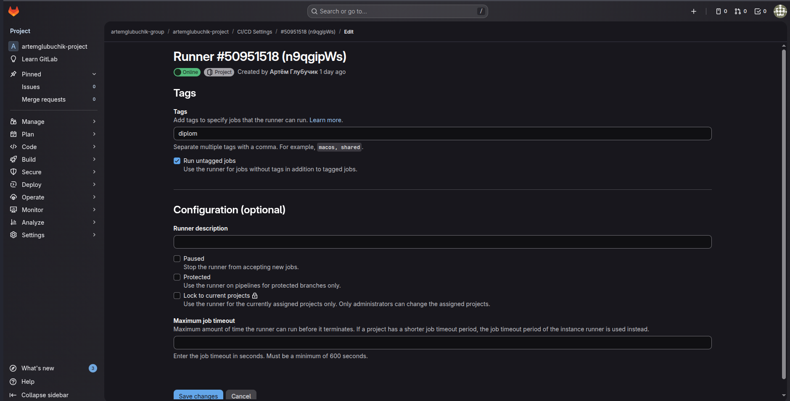
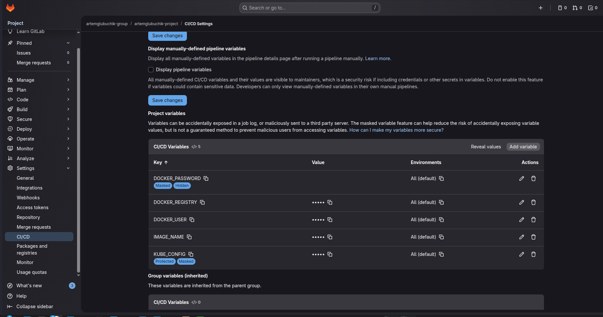

# Дипломный практикум в Yandex.Cloud
  * [Цели:](#цели)
  * [Этапы выполнения:](#этапы-выполнения)
     * [Создание облачной инфраструктуры](#создание-облачной-инфраструктуры)
     * [Создание Kubernetes кластера](#создание-kubernetes-кластера)
     * [Создание тестового приложения](#создание-тестового-приложения)
     * [Подготовка cистемы мониторинга и деплой приложения](#подготовка-cистемы-мониторинга-и-деплой-приложения)
     * [Установка и настройка CI/CD](#установка-и-настройка-cicd)
  * [Что необходимо для сдачи задания?](#что-необходимо-для-сдачи-задания)
  * [Как правильно задавать вопросы дипломному руководителю?](#как-правильно-задавать-вопросы-дипломному-руководителю)

**Перед началом работы над дипломным заданием изучите [Инструкция по экономии облачных ресурсов](https://github.com/netology-code/devops-materials/blob/master/cloudwork.MD).**

---
## Цели:

1. Подготовить облачную инфраструктуру на базе облачного провайдера Яндекс.Облако.
2. Запустить и сконфигурировать Kubernetes кластер.
3. Установить и настроить систему мониторинга.
4. Настроить и автоматизировать сборку тестового приложения с использованием Docker-контейнеров.
5. Настроить CI для автоматической сборки и тестирования.
6. Настроить CD для автоматического развёртывания приложения.

---
## Этапы выполнения:


### Создание облачной инфраструктуры

Для начала необходимо подготовить облачную инфраструктуру в ЯО при помощи [Terraform](https://www.terraform.io/).

Особенности выполнения:

- Бюджет купона ограничен, что следует иметь в виду при проектировании инфраструктуры и использовании ресурсов;
Для облачного k8s используйте региональный мастер(неотказоустойчивый). Для self-hosted k8s минимизируйте ресурсы ВМ и долю ЦПУ. В обоих вариантах используйте прерываемые ВМ для worker nodes.

Предварительная подготовка к установке и запуску Kubernetes кластера.

1. Создайте сервисный аккаунт, который будет в дальнейшем использоваться Terraform для работы с инфраструктурой с необходимыми и достаточными правами. Не стоит использовать права суперпользователя
2. Подготовьте [backend](https://developer.hashicorp.com/terraform/language/backend) для Terraform:  
   а. Рекомендуемый вариант: S3 bucket в созданном ЯО аккаунте(создание бакета через TF)
   б. Альтернативный вариант:  [Terraform Cloud](https://app.terraform.io/)
3. Создайте конфигурацию Terrafrom, используя созданный бакет ранее как бекенд для хранения стейт файла. Конфигурации Terraform для создания сервисного аккаунта и бакета и основной инфраструктуры следует сохранить в разных папках.
4. Создайте VPC с подсетями в разных зонах доступности.
5. Убедитесь, что теперь вы можете выполнить команды `terraform destroy` и `terraform apply` без дополнительных ручных действий.
6. В случае использования [Terraform Cloud](https://app.terraform.io/) в качестве [backend](https://developer.hashicorp.com/terraform/language/backend) убедитесь, что применение изменений успешно проходит, используя web-интерфейс Terraform cloud.

Ожидаемые результаты:

1. Terraform сконфигурирован и создание инфраструктуры посредством Terraform возможно без дополнительных ручных действий, стейт основной конфигурации сохраняется в бакете или Terraform Cloud
2. Полученная конфигурация инфраструктуры является предварительной, поэтому в ходе дальнейшего выполнения задания возможны изменения.

---
### Создание Kubernetes кластера

На этом этапе необходимо создать [Kubernetes](https://kubernetes.io/ru/docs/concepts/overview/what-is-kubernetes/) кластер на базе предварительно созданной инфраструктуры.   Требуется обеспечить доступ к ресурсам из Интернета.

Это можно сделать двумя способами:

1. Рекомендуемый вариант: самостоятельная установка Kubernetes кластера.  
   а. При помощи Terraform подготовить как минимум 3 виртуальных машины Compute Cloud для создания Kubernetes-кластера. Тип виртуальной машины следует выбрать самостоятельно с учётом требовании к производительности и стоимости. Если в дальнейшем поймете, что необходимо сменить тип инстанса, используйте Terraform для внесения изменений.  
   б. Подготовить [ansible](https://www.ansible.com/) конфигурации, можно воспользоваться, например [Kubespray](https://kubernetes.io/docs/setup/production-environment/tools/kubespray/)  
   в. Задеплоить Kubernetes на подготовленные ранее инстансы, в случае нехватки каких-либо ресурсов вы всегда можете создать их при помощи Terraform.
2. Альтернативный вариант: воспользуйтесь сервисом [Yandex Managed Service for Kubernetes](https://cloud.yandex.ru/services/managed-kubernetes)  
  а. С помощью terraform resource для [kubernetes](https://registry.terraform.io/providers/yandex-cloud/yandex/latest/docs/resources/kubernetes_cluster) создать **региональный** мастер kubernetes с размещением нод в разных 3 подсетях      
  б. С помощью terraform resource для [kubernetes node group](https://registry.terraform.io/providers/yandex-cloud/yandex/latest/docs/resources/kubernetes_node_group)
  
Ожидаемый результат:

1. Работоспособный Kubernetes кластер.
2. В файле `~/.kube/config` находятся данные для доступа к кластеру.
3. Команда `kubectl get pods --all-namespaces` отрабатывает без ошибок.

---
### Создание тестового приложения

Для перехода к следующему этапу необходимо подготовить тестовое приложение, эмулирующее основное приложение разрабатываемое вашей компанией.

Способ подготовки:

1. Рекомендуемый вариант:  
   а. Создайте отдельный git репозиторий с простым nginx конфигом, который будет отдавать статические данные.  
   б. Подготовьте Dockerfile для создания образа приложения.  
2. Альтернативный вариант:  
   а. Используйте любой другой код, главное, чтобы был самостоятельно создан Dockerfile.

Ожидаемый результат:

1. Git репозиторий с тестовым приложением и Dockerfile.
2. Регистри с собранным docker image. В качестве регистри может быть DockerHub или [Yandex Container Registry](https://cloud.yandex.ru/services/container-registry), созданный также с помощью terraform.

---
### Подготовка cистемы мониторинга и деплой приложения

Уже должны быть готовы конфигурации для автоматического создания облачной инфраструктуры и поднятия Kubernetes кластера.  
Теперь необходимо подготовить конфигурационные файлы для настройки нашего Kubernetes кластера.

Цель:
1. Задеплоить в кластер [prometheus](https://prometheus.io/), [grafana](https://grafana.com/), [alertmanager](https://github.com/prometheus/alertmanager), [экспортер](https://github.com/prometheus/node_exporter) основных метрик Kubernetes.
2. Задеплоить тестовое приложение, например, [nginx](https://www.nginx.com/) сервер отдающий статическую страницу.

Способ выполнения:
1. Воспользоваться пакетом [kube-prometheus](https://github.com/prometheus-operator/kube-prometheus), который уже включает в себя [Kubernetes оператор](https://operatorhub.io/) для [grafana](https://grafana.com/), [prometheus](https://prometheus.io/), [alertmanager](https://github.com/prometheus/alertmanager) и [node_exporter](https://github.com/prometheus/node_exporter). Альтернативный вариант - использовать набор helm чартов от [bitnami](https://github.com/bitnami/charts/tree/main/bitnami).

### Деплой инфраструктуры в terraform pipeline

1. Если на первом этапе вы не воспользовались [Terraform Cloud](https://app.terraform.io/), то задеплойте и настройте в кластере [atlantis](https://www.runatlantis.io/) для отслеживания изменений инфраструктуры. Альтернативный вариант 3 задания: вместо Terraform Cloud или atlantis настройте на автоматический запуск и применение конфигурации terraform из вашего git-репозитория в выбранной вами CI-CD системе при любом комите в main ветку. Предоставьте скриншоты работы пайплайна из CI/CD системы.

Ожидаемый результат:
1. Git репозиторий с конфигурационными файлами для настройки Kubernetes.
2. Http доступ на 80 порту к web интерфейсу grafana.
3. Дашборды в grafana отображающие состояние Kubernetes кластера.
4. Http доступ на 80 порту к тестовому приложению.
5. Atlantis или terraform cloud или ci/cd-terraform
---
### Установка и настройка CI/CD

Осталось настроить ci/cd систему для автоматической сборки docker image и деплоя приложения при изменении кода.

Цель:

1. Автоматическая сборка docker образа при коммите в репозиторий с тестовым приложением.
2. Автоматический деплой нового docker образа.

Можно использовать [teamcity](https://www.jetbrains.com/ru-ru/teamcity/), [jenkins](https://www.jenkins.io/), [GitLab CI](https://about.gitlab.com/stages-devops-lifecycle/continuous-integration/) или GitHub Actions.

Ожидаемый результат:

1. Интерфейс ci/cd сервиса доступен по http.
2. При любом коммите в репозиторие с тестовым приложением происходит сборка и отправка в регистр Docker образа.
3. При создании тега (например, v1.0.0) происходит сборка и отправка с соответствующим label в регистри, а также деплой соответствующего Docker образа в кластер Kubernetes.

---
## Что необходимо для сдачи задания?

1. Репозиторий с конфигурационными файлами Terraform и готовность продемонстрировать создание всех ресурсов с нуля.
2. Пример pull request с комментариями созданными atlantis'ом или снимки экрана из Terraform Cloud или вашего CI-CD-terraform pipeline.
3. Репозиторий с конфигурацией ansible, если был выбран способ создания Kubernetes кластера при помощи ansible.
4. Репозиторий с Dockerfile тестового приложения и ссылка на собранный docker image.
5. Репозиторий с конфигурацией Kubernetes кластера.
6. Ссылка на тестовое приложение и веб интерфейс Grafana с данными доступа.
7. Все репозитории рекомендуется хранить на одном ресурсе (github, gitlab)


# Выполнение диплома.

## Подготовка сервисного аккаунта и бэкенда

Подготовил отдельный манифест [01-Сloud infrastructure](01-Сloud%20infrastructure/)

[Манифест 01-Сloud infrastructure/main.tf](01-Сloud%20infrastructure/main.tf):
- Cоздает сервисный аккаунта, который будет использоваться для создания бакета, сети, подсетей и виртуальных машин
- Выдает сервисному аккаунту роли: 
   - storage.admin - для создания и управления бакета S3
   - vpc.admin - для создания и управления сетями и подсетями
   - compute.admin - для создания и управления ВМ
   - viewer - для просмотра ресурсов
- Создает S3 бакет для хранения бэкенда основного манифеста
- Создает файл backend.conf в директории основного манифеста [02-Deployment](02-Deployment/)
- Создает ключ авторизации Сервисного аккаунта в домашней директории, для его использования в основном манифесте 

Для работы манифеста нужно задать переменные  `cloud_id` и `folder_id`, и указать как подключаться к облаку в `provider "yandex"` (service_account_key_file или token)

С помощью переменной `bucket_name` можно изменить название S3 хранилища (нужно будет поменять название хранилища в [02-Deployment/providers.tf](02-Deployment/providers.tf))
## Разворот приложения 

Создана отдельная директория для основного проэкта [02-Deployment](02-Deployment/)

Подключение к S3 настроено в [02-Deployment/providers.tf](02-Deployment/providers.tf)
```
  backend "s3" {
    endpoints = {
      s3 = "https://storage.yandexcloud.net"
    }
    bucket     = "glubuchik-diplom"
    key        = "diplom/terraform.tfstate"
    region     = "ru-central1"

    skip_region_validation      = true
    skip_credentials_validation = true
    skip_requesting_account_id  = true
    skip_s3_checksum            = true
  }
```
так-же настроено использование ключа сервисного аккаунта созданного в [01-Сloud infrastructure]
```
provider "yandex" {
  cloud_id                  = var.cloud_id
  folder_id                 = var.folder_id
  zone                      = var.default_zone
  service_account_key_file  = file("~/.sa-diplom-key.json")
}
```
Запускать terraform init нужно с указанием файла конфигурации для бэкенда
```
terraform init -backend-config=backend.conf
```
Для работы манифеста нужно задать переменные `cloud_id`, `folder_id`, `grafana_admin_password`(пароль для входа в графану), `gitlab_runner_token`(токен для подключения ранера к Gitlab)


Приложение разделил на 3 модуля:

- [compute](02-Deployment/modules/compute) - Модуль подготавливает сеть и ВМ для разорота K8S
- [kubernetes](02-Deployment/modules/kubernetes) - Разворачивает на подготовленных модулем [compute](02-Deployment/modules/compute) виртуальных машинах K8S кластер
- [applications](02-Deployment/modules/applications) - Разворачивает в K8S кластере приложения (мониторинг, раннер для GitLab, приложение диплома)


### Модуль [compute](02-Deployment/modules/compute)

- Создает сеть
- Создает 2 подсети, можно изменить с помощью переменной
```
variable "vpc_subnet" {
  type        = map(object({
    name = string,
    zone = string,
    cidr = list(string)
    }))
  default     = {
    subnet1  = {
        name = "subnet1",
        zone = "ru-central1-a",
        cidr = ["192.168.10.0/24"]
        },
    subnet2 = {
        name = "subnet2",
        zone = "ru-central1-b",
        cidr = ["192.168.20.0/24"]
    }}
  
  description = "Конфигурация подсетей"
}
```
- Создает Мастер ноды в подсети subnet1
```
variable "master_nodes" {
  type = object({
    count         = number
    name_prefix   = string
    platform_id   = string
    cores         = number
    memory        = number
    core_fraction = number
    disk_size     = number
    disk_type     = string
    image_family  = string
    nat           = bool
    preemptible   = bool
  })
  
  default = {
    count         = 1
    name_prefix   = "master"
    platform_id   = "standard-v1"
    cores         = 2
    memory        = 4
    core_fraction = 100
    disk_size     = 20
    disk_type     = "network-ssd"
    image_family  = "ubuntu-2204-lts"
    nat           = true
    preemptible   = true
  }
  
  description = "Конфигурация мастер-нод"
}
```
- Создает Воркер ноды в подсети subnet2
```
variable "worker_nodes" {
  type = object({
    count         = number
    name_prefix   = string
    platform_id   = string
    cores         = number
    memory        = number
    core_fraction = number
    disk_size     = number
    disk_type     = string
    image_family  = string
    nat           = bool
    preemptible   = bool
  })
  
  default = {
    count         = 2
    name_prefix   = "worker"
    platform_id   = "standard-v1"
    cores         = 4
    memory        = 8
    core_fraction = 100
    disk_size     = 30
    disk_type     = "network-hdd"
    image_family  = "ubuntu-2204-lts"
    nat           = true
    preemptible   = true
  }
  
  description = "Конфигурация воркер-нод"
}
```
- Создает инвентарь [hosts.yaml](02-Deployment/modules/compute/inventory/hosts.yaml) для kubespray который будет использовать модуль [kubernetes](02-Deployment/modules/kubernetes)
- Если переменная update_hosts = true, внесет изменения в /etc/hosts (требуется запуск от SUDO или ввод пароля во время выполнения манифеста)
добавит внешний IP мастера для хостов указанных в переменных 
```
variable "diplom_host" {
  description = "Host для доступа к странице диплома"
  type        = string
  default     = "diplom.aglubuchik.com"
}

variable "grafana_host" {
  description = "Host для доступа к странице мониторинга"
  type        = string
  default     = "grafana.aglubuchik.com"
}
```

Для доступа к ВМ нужно указать пользователя и открытый ключ
```
variable "ssh_public_key" {
  type        = string
  default     = ""
  description = <<-EOT
    SSH публичный ключ для доступа к ВМ.
    Может быть указан напрямую или через переменную ssh_public_key_file.
    Формат: "ssh-rsa AAAAB3NzaC1yc2EAAAADAQABAAABAQC..."
    Приоритет: ssh_public_key > ssh_public_key_file
  EOT
  sensitive   = true
  
  validation {
    condition = var.ssh_public_key == "" || can(regex("^ssh-(rsa|ed25519|dss|ecdsa-sha2-nistp(256|384|521)) AAAA[0-9A-Za-z+/]+[=]{0,3}( .*)?\\s*$", var.ssh_public_key))
    error_message = "SSH публичный ключ должен быть в формате: ssh-rsa AAAAB3NzaC1yc2EAAAADAQABAAABAQC..."
  }
}

variable "ssh_public_key_file" {
  type        = string
  default     = "~/.ssh/id_rsa.pub"
  description = <<-EOT
    Путь до файла с публичным SSH ключом.
    Используется, если ssh_public_key не указан.
    Поддерживаются абсолютные и относительные пути.
    Может содержать ~ для домашней директории.
  EOT
  
  validation {
    condition     = var.ssh_public_key_file == "" || can(regex("^[~/a-zA-Z0-9_.\\-/]+$", var.ssh_public_key_file))
    error_message = "Некорректный путь к файлу SSH ключа"
  }
}


variable "ssh_username" {
  type        = string
  default     = "ubuntu"
  description = "Имя пользователя для SSH"
}
```

Можно настроить [cloud-init.yml](02-Deployment/modules/compute/cloud-init.yml) для изменения настроек поднимаемых ВМ.

### Модуль [kubernetes](02-Deployment/modules/kubernetes)

- Устанавливает python3 на машину, с которой запускается Terraform.
- Создает виртуальное окружение в [kubernetes/venv](02-Deployment/modules/kubernetes/venv)
- Устанавливает через pip3 ansible
- Клонирует https://github.com/kubernetes-sigs/kubespray.git в [kubernetes/kubespray](02-Deployment/modules/kubernetes/kubespray)
- Устанавливает зависимости kubespray
- Переносит указанный в переменной инвентарь в kubespray/inventory/mycluster/hosts.yaml
```
variable "hosts_path" {
  type        = string
  default     = "../compute/inventory/hosts.yaml"
  description = "Путь к файлу hosts.yaml"
}
```
- Запускает 
```
ansible-playbook -i inventory/mycluster/hosts.yaml \
  -u ${self.triggers.ssh_username} \
  --become --become-user=root \
  -e "kubeconfig_localhost=true" \
  -e "download_timeout=120" \
  cluster.yml \
  --flush-cache
```

### Модуль [applications](02-Deployment/modules/applications)

(хотел сделать с помощью провайдеров, но пока так и не смог заставить провайдеры нормально брать конфиг для доступа к кластеру созданный модулем [kubernetes](02-Deployment/modules/kubernetes))

- Устанавливает через helm prometheus-community/kube-prometheus-stack.
Можно указать пароль для доступа к Grafana
```
variable "grafana_admin_password" {
  type        = string
  sensitive   = true
  default     = "4-o7blNIb95"
  description = "Grafana admin password"
}
```

- Устанавливает через helm ingress-nginx/ingress-nginx.
Можно указать порт для доступа к Grafana
```
variable "ingress_http_nodeport" {
  type        = number
  default     = 30080
  description = "NodePort for HTTP ingress"
}
```
- Устанавливает через helm gitlab/gitlab-runner.
Нужно указать токен для подключения ранера к Gitlab
```
variable "gitlab_runner_token" {
  type        = string
  description = "GitLab Runner registration token"
}
```
Можно сконфигурировать Runner с помощью файла [runner/values.yaml](02-Deployment/modules/applications/runner/values.yaml)

- Скачивает из GitLab манифест диплома в зависимости от указанного тега
и сохраняет его в [applications/diplom.yaml](02-Deployment/modules/applications/diplom.yaml)
(если тег не указан или равен latest, скачивает и запускает манифест из ветки main, если тег указан скачивается манифест из ветки с указанным тегом и использует для поднятия приложения образ с указанным тегом)
- Устанавливает приложение из diplom.yaml


## Приложение для диплома

Создал станицу для демонстрации через nginx

Создал dockerfile:
```
FROM nginx:1.29.0
RUN rm -rf /usr/share/nginx/html/*
COPY html/ /usr/share/nginx/html/
EXPOSE 80
```
Создаю репозиторий для тестового приложения https://gitlab.com/artemglubuchik-group/artemglubuchik-project

Авторизуюсь на hub.docker.com
```
docker login
```

Создаю образ из dockerfile
```
docker build . -t aglubuchik/diplom-application:0.1
```

Загружаю на docker hud
```
docker push aglubuchik/diplom-application:0.1
```
Ссылка на реестр Docker Hub: https://hub.docker.com/repository/docker/aglubuchik/diplom-application/general

## Манифест для запуска приложения

https://gitlab.com/artemglubuchik-group/artemglubuchik-project/-/blob/main/k8s/diplom.yaml?ref_type=heads

Создает namespace
```
apiVersion: v1
kind: Namespace
metadata:
  name: diplom
  labels:
    name: diplom
```
Создает Deployment с двумя репликами приложения из подготовленного ранее образа
```
apiVersion: apps/v1
kind: Deployment
metadata:
  name: diplom-app
  namespace: diplom
  labels:
    app: diplom-app
spec:
  replicas: 2
  selector:
    matchLabels:
      app: diplom-app
  template:
    metadata:
      labels:
        app: diplom-app
    spec:
      containers:
      - name: diplom-application
        image: aglubuchik/diplom-application:0.1
        resources:
          requests:
            cpu: "1"
            memory: "200Mi"
          limits:
            cpu: "2"
            memory: "400Mi"
        ports:
        - containerPort: 80
```
Создает сервис для приложения
```
apiVersion: v1
kind: Service
metadata:
  name: diplom-app
  namespace: diplom
spec:
  selector:
    app: diplom-app
  ports:
  - name: http
    port: 80
    targetPort: 80
  type: ClusterIP
```
Создает ингресы для доступа из интернета к приложению и мониторингу
```
apiVersion: networking.k8s.io/v1
kind: Ingress
metadata:
  name: diplom-ingress
  namespace: diplom
  annotations:
    nginx.ingress.kubernetes.io/rewrite-target: /
    nginx.ingress.kubernetes.io/use-regex: "true"
spec:
  ingressClassName: nginx
  rules:
  - host: diplom.aglubuchik.com
    http:
      paths:
      - path: /
        pathType: Prefix
        backend:
          service:
            name: diplom-app
            port:
              number: 80
---
apiVersion: networking.k8s.io/v1
kind: Ingress
metadata:
  name: grafana-ingress
  namespace: monitoring
  annotations:
    nginx.ingress.kubernetes.io/rewrite-target: /
    nginx.ingress.kubernetes.io/use-regex: "true"
spec:
  ingressClassName: nginx
  rules:
  - host: grafana.aglubuchik.com
    http:
      paths:
      - path: /
        pathType: Prefix
        backend:
          service:
            name: monitoring-grafana
            port:
              number: 80
```

## Установка и настройка CI/CD
### Настройка проэкта 
В созданом [проэкте](https://gitlab.com/artemglubuchik-group/artemglubuchik-project)

- Создаю ранер для GitLab (Settings -> CI/CD -> Runners) (Без него нужно подтвердить учетную запись, а это нельзя сделать без иностранного телефона и карты).
   - Токен ранера сохраняю в переменную `gitlab_runner_token` `02-Deployment/personal.auto.tfvars`


- Создаю переменные для CI/CD (Settings -> CI/CD -> Variables)
   - DOCKER_REGISTRY - где находятся образы (https://index.docker.io/v2/)
   - DOCKER_USER - пользователь для доступа к DOCKER_REGISTRY, чтобы загрудать туда образы
   - DOCKER_PASSWORD - пароль пользователя для доступа к DOCKER_REGISTRY
   - IMAGE_NAME - название образа для диплома (diplom-application)
   - KUBE_CONFIG - конфигурация для подключения к кластеру K8S созданая с помощью модуля [kubernetes](02-Deployment/modules/kubernetes) (нужно преобразовать конфиг 02-Deployment/modules/kubernetes/kubernetes/kubespray/inventory/mycluster/artifacts/admin.conf в base64 и указать его в Value без пробелов и переноса строк)

- Cоздаю [.gitlab-ci.yml](https://gitlab.com/DemoniumBlack/diplom-test-site/-/blob/main/.gitlab-ci.yml?ref_type=heads)
```
stages: # Этапы
  - build # Сборка образа
  - deploy # Разворот приложения в K8S

variables: # Переменные
  IMAGE_TAG_LATEST: latest
  IMAGE_TAG_COMMIT: ${CI_COMMIT_SHORT_SHA}   # короткий хэш коммита
  VERSION: ${CI_COMMIT_TAG}                  # тег коммита, если тег есть
  NAMESPACE: "diplom"                        # namespace в Kubernetes
  DEPLOYMENT_NAME: "diplom-app"              # имя деплоймента в Kubernetes

# Сборка образа
build:
  stage: build
  image: gcr.io/kaniko-project/executor:v1.24.0-debug # образ Kaniko (инструмент для сборки Docker-образов без Docker daemon)
  tags: # теги для ранеров
    - diplom
  only: # запускается только для ветки main и тегов
    - main
    - tags
  script:
    - echo "Building Docker image..."
   # Создаем файл для аутентификации в Docker Registry
    - mkdir -p /kaniko/.docker
    - |
      cat > /kaniko/.docker/config.json << EOF
      {
        "auths": {
          "https://index.docker.io/v1/": {
            "auth": "$(echo -n "${DOCKER_USER}:${DOCKER_PASSWORD}" | base64 | tr -d '\n')"
          },
          "https://index.docker.io/v2/": {
            "auth": "$(echo -n "${DOCKER_USER}:${DOCKER_PASSWORD}" | base64 | tr -d '\n')"
          }
        }
      }
      EOF
   # Если VERSION не установлен (нет тега), используем хэш коммита
    - if [ -z "$VERSION" ]; then VERSION=$IMAGE_TAG_COMMIT; fi
   # Сборка и пушинг образа с двумя тегами:
   # 1. С версией (тег коммита или хэш)
    - |
      /kaniko/executor \
        --context ${CI_PROJECT_DIR} \
        --dockerfile ${CI_PROJECT_DIR}/dockerfile \
        --destination "${DOCKER_USER}/${IMAGE_NAME}:${VERSION}" \
        --cache=true \
        --verbosity=info
   # 2. С тегом latest
    - |
      /kaniko/executor \
        --context ${CI_PROJECT_DIR} \
        --dockerfile ${CI_PROJECT_DIR}/dockerfile \
        --destination "${DOCKER_USER}/${IMAGE_NAME}:${IMAGE_TAG_LATEST}" \
        --cache=true \
        --verbosity=info

# Разворот приложения в K8S
deploy:
  stage: deploy
  image: bitnami/kubectl:latest # образ с установленным kubectl
  tags: # теги для ранеров
    - diplom 
  only: # запускается только для ветки main и тегов
    - main
    - tags
  script:
    - echo "Deploying to Kubernetes..."
    - echo $KUBE_CONFIG | base64 -d > kubeconfig
    - export KUBECONFIG=kubeconfig
    - kubectl apply -f k8s/
   # Если VERSION не установлен (нет тега), используем хэш коммита
    - if [ -z "$VERSION" ]; then VERSION=$IMAGE_TAG_COMMIT; fi
   # Обновление образа в деплойменте
    - kubectl --kubeconfig=kubeconfig set image deployment/${DEPLOYMENT_NAME} ${IMAGE_NAME}=${DOCKER_USER}/${IMAGE_NAME}:$VERSION --namespace=${NAMESPACE}
   # Рестарт деплоймента для применения изменений
    - kubectl --kubeconfig=kubeconfig rollout restart deployment/${DEPLOYMENT_NAME} --namespace=${NAMESPACE}
   # Ожидание завершения
    - kubectl --kubeconfig=kubeconfig rollout status deployment/${DEPLOYMENT_NAME} --namespace=${NAMESPACE}
  when: on_success  # запускается только если build прошел успешно
```


